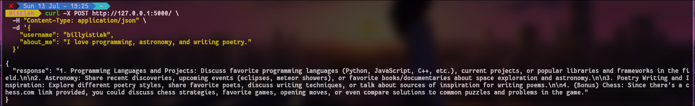

# Series.so Conversation Assistant — Proof of Concept
(AI paraphrased)

This PoC demonstrates how **Series.so** can deliver business value by analyzing user social data and suggesting personalized conversation topics to enhance engagement.

---

## PoC Overview

A Flask-based prototype that:

- Uses Sherlock to fetch public social links given a username.
- Constructs a prompt based on about_me and fetched links.
- Calls the **Mistral model via Ollama CLI** to generate **three bullet‑point conversation topics**.
- Exposes a `POST /` endpoint returning the topics in JSON.

## The downside of the script

- Sherlock takes too long to load the social media accounts
- It doesn't check the contents on the sites.
- It used an unreliable AI model.
- The model takes too long to find answer.

### Example

**Request:**
```json
{
  "username": "billyistiak",
  "about_me": "I write code and love chess."
}
```
**Response:**
```json
{
  "response": "- Topic 1\n- Topic 2\n- Topic 3"
}
```


Setup
```
git clone git@github.com:b-Istiak-s/PoC-series.git
cd PoC-series
git clone git@github.com:sherlock-project/sherlock.git app/service/sherlock_repo
python3 -m venv venv
source venv/bin/activate
pip install -r requirements.txt
ollama pull mistral
```

<details>
<summary>File Structure</summary>

PoC-series/
├── app
│   ├── __init__.py
│   ├── __pycache__
│   │   └── __init__.cpython-313.pyc
│   ├── routes
│   │   ├── main.py
│   │   └── __pycache__
│   │       └── main.cpython-313.pyc
│   └── service
│       ├── __pycache__
│       │   └── sherlock.cpython-313.pyc
│       ├── sherlock.py
│       └── sherlock_repo
│           ├── devel
│           │   └── site-list.py
│           ├── Dockerfile
│           ├── docs
│           │   ├── CODE_OF_CONDUCT.md
│           │   ├── images
│           │   │   ├── demo.png
│           │   │   └── sherlock-logo.png
│           │   ├── pyproject
│           │   │   └── README.md
│           │   ├── README.md
│           │   └── removed-sites.md
│           ├── LICENSE
│           ├── pyproject.toml
│           ├── pytest.ini
│           ├── sherlock_project
│           │   ├── __init__.py
│           │   ├── __main__.py
│           │   ├── notify.py
│           │   ├── __pycache__
│           │   │   └── __main__.cpython-313.pyc
│           │   ├── py.typed
│           │   ├── resources
│           │   │   ├── data.json
│           │   │   └── data.schema.json
│           │   ├── result.py
│           │   ├── sherlock.py
│           │   └── sites.py
│           ├── tests
│           │   ├── conftest.py
│           │   ├── few_test_basic.py
│           │   ├── sherlock_interactives.py
│           │   ├── test_manifest.py
│           │   ├── test_probes.py
│           │   ├── test_ux.py
│           │   └── test_version.py
│           └── tox.ini
├── billyistiak.txt
├── config.py
├── image.png
├── __pycache__
│   └── config.cpython-313.pyc
├── README.md
├── requirements.txt
└── run.py

17 directories, 42 files

</details>